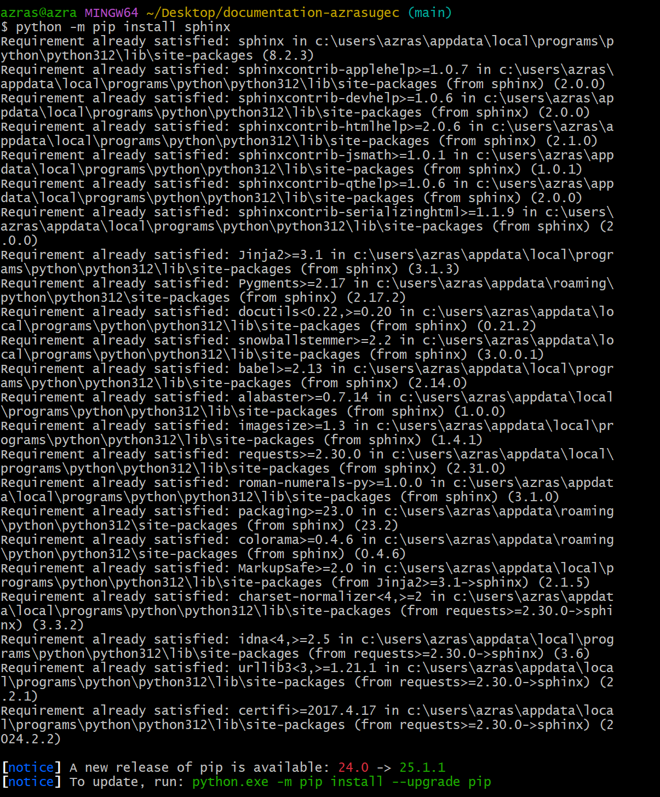
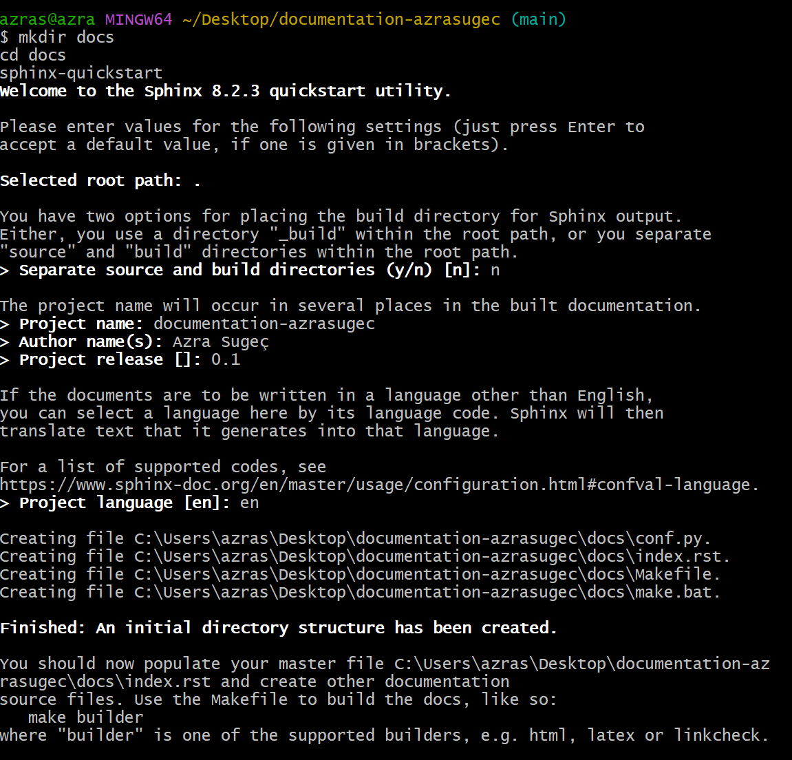
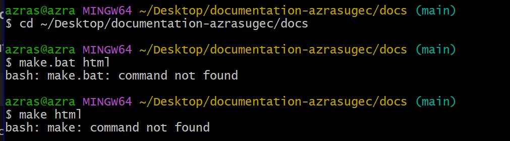
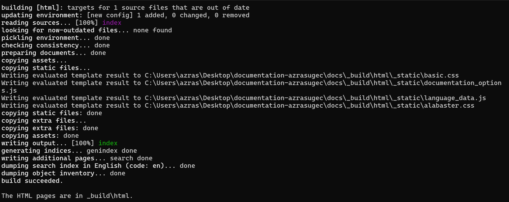
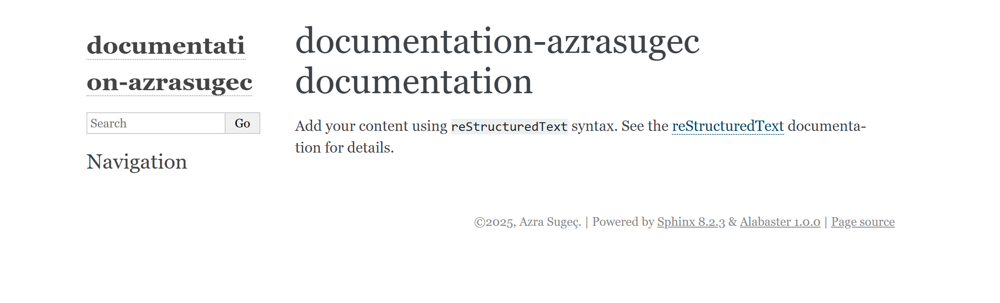
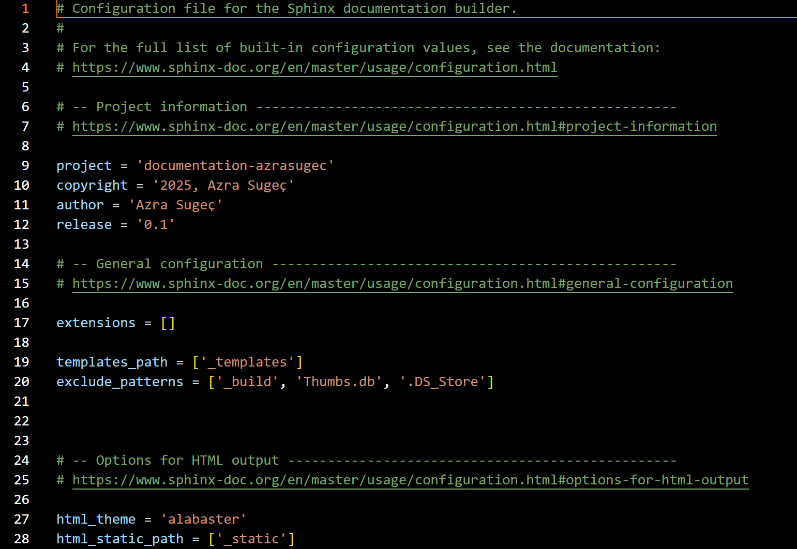
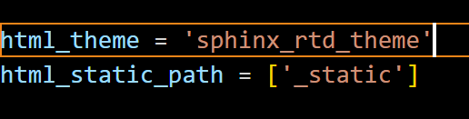
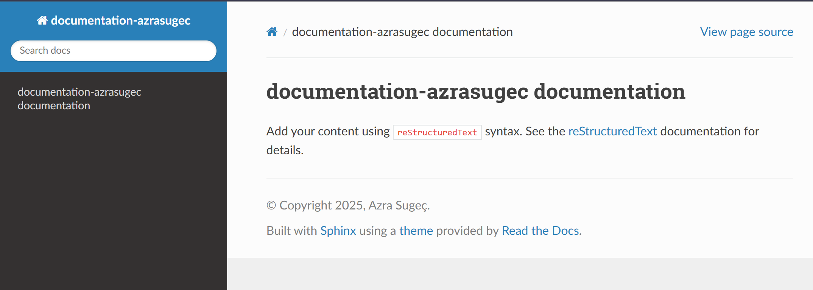
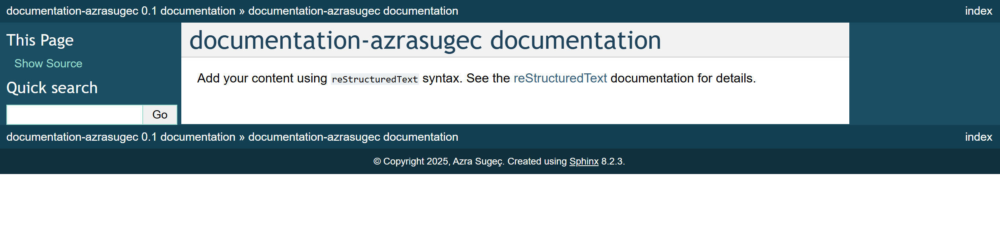

[site](https://azrasugec.github.io/Assignment5/)
# Assignment #5 – Documentation with Sphinx

In this assignment, I used **Sphinx** to generate automatic documentation for my Python project. Documentation is a key step in building long-lasting and maintainable software.

The steps I followed include:

- Installing Sphinx
- Creating the documentation skeleton
- Generating `.rst` files from Python code
- Exploring and applying at least two different themes
- Building and viewing HTML output

Below are the detailed steps with explanations and images. A summary table is included at the end.

---

## Step 1 – Installing Sphinx

To start documenting my Python project, I first installed **Sphinx**:

```bash
python -m pip install sphinx
```

Sphinx and its dependencies were already installed on my system. You may see output indicating the packages are already satisfied.



---

## Step 2 – Setting up the Sphinx Project Structure

After installing Sphinx, I created a documentation folder and initialized it with:

```bash
mkdir docs
cd docs
sphinx-quickstart
```

During the quickstart, I entered project name, author, and language options.



---

## Step 3 – Encountered Error: `make` or `make.bat` Not Found

While trying to build the documentation using Git Bash, I received the following errors:

```bash
make.bat html
bash: make.bat: command not found

make html
bash: make: command not found
```

This happened because `make.bat` must be run in Command Prompt, not in Git Bash.



---

## Step 4 – Building HTML Output Successfully

I switched to **Command Prompt (cmd.exe)** and used:

```cmd
make.bat html
```

This time, the documentation was successfully built into `_build/html`.



---

## Step 5 – Viewing the Generated HTML Documentation

I opened the generated HTML page:

```text
_build/html/index.html
```

This displayed the default Sphinx output using the Alabaster theme.



---

## Step 6 – Changing the Theme to Alabaster

In the `conf.py` file, I modified the theme:

```python
html_theme = 'alabaster'
```



---

## Step 7 – Trying the Read the Docs Theme

Then I tested a different layout by switching to:

```python
html_theme = 'sphinx_rtd_theme'
```

Make sure this theme is installed:

```bash
pip install sphinx_rtd_theme
```



---

## Step 8 – Final Output with sphinx_rtd_theme

After applying the Read the Docs theme, I rebuilt the docs and viewed the updated design.



---

## Step 9 – Trying the Classic Theme

For comparison, I also tested Sphinx’s built-in `classic` theme:

```python
html_theme = 'classic'
```



---

## 📊 Summary Table

| Step | Description                                      | Command / Action                                | Screenshot     |
|------|--------------------------------------------------|--------------------------------------------------|----------------|
| 1    | Install Sphinx                                   | `python -m pip install sphinx`                  | `img/ss1.png`  |
| 2    | Initialize project with `sphinx-quickstart`      | `sphinx-quickstart`                             | `img/ss2.png`  |
| 3    | Encounter error in Git Bash                      | `make.bat` and `make` → command not found       | `img/ss3.png`  |
| 4    | Fix by switching to Command Prompt               | `make.bat html`                                 | `img/ss4.png`  |
| 5    | View generated HTML docs                         | Open `_build/html/index.html`                   | `img/ss5.png`  |
| 6    | Change theme to `alabaster`                      | `html_theme = 'alabaster'`                      | `img/ss6.png`  |
| 7    | Test `sphinx_rtd_theme`                          | `html_theme = 'sphinx_rtd_theme'`               | `img/ss7.png`  |
| 8    | View documentation with new theme                | View in browser                                 | `img/ss8.png`  |
| 9    | Try classic theme for comparison                 | `html_theme = 'classic'`                        | `img/ss9.png`  |
